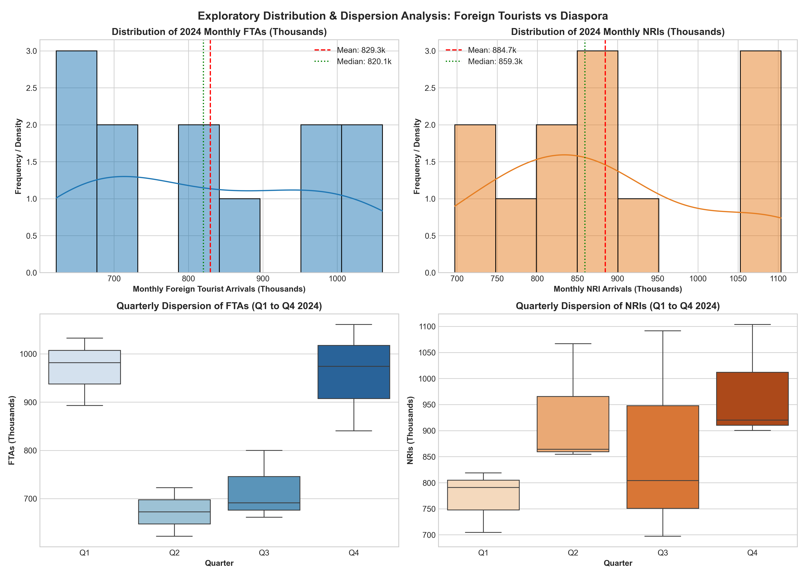
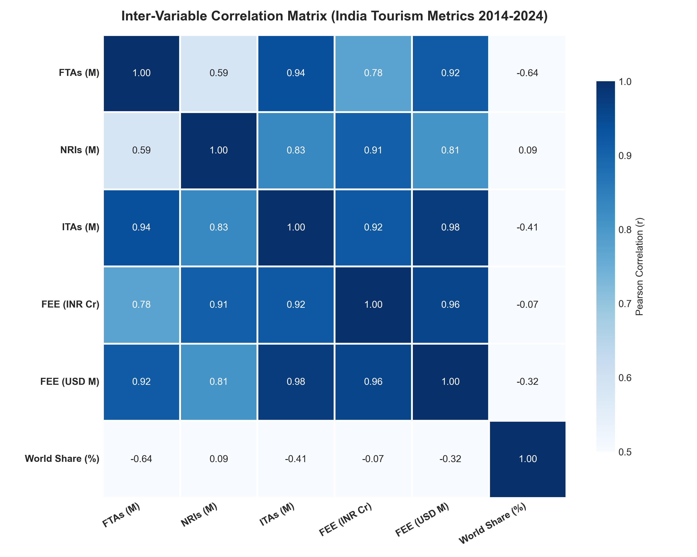
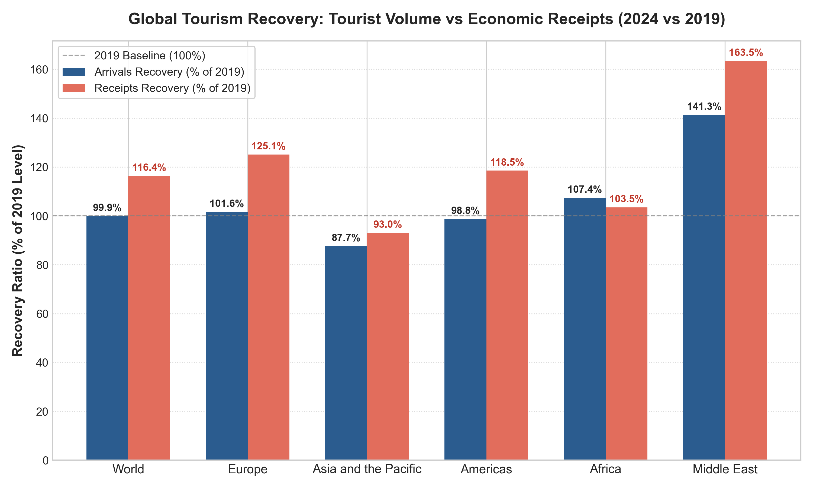
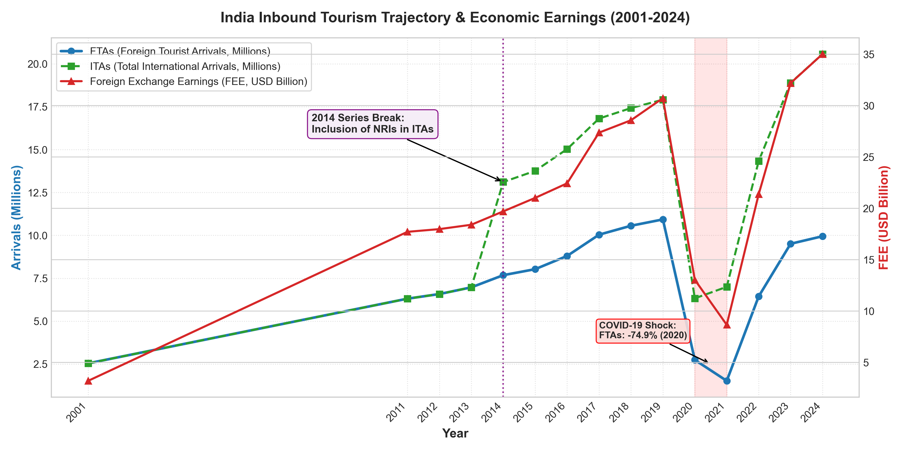
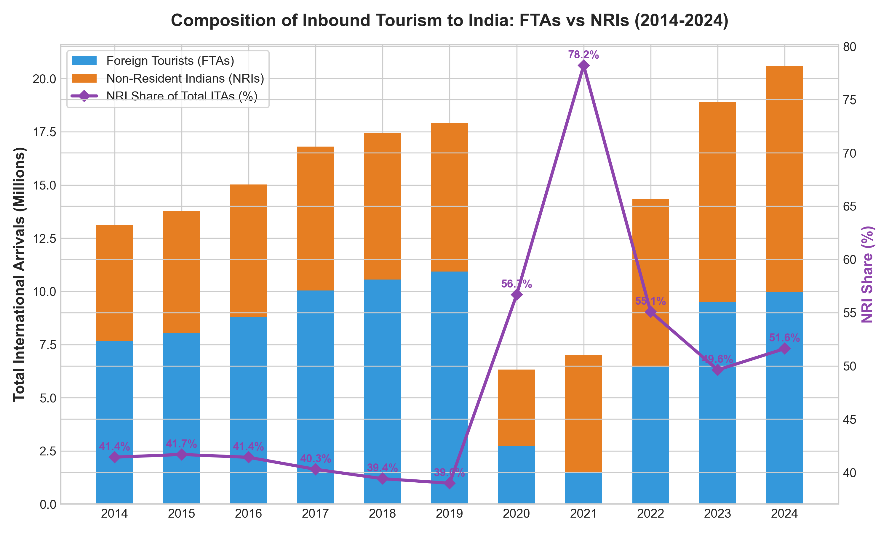
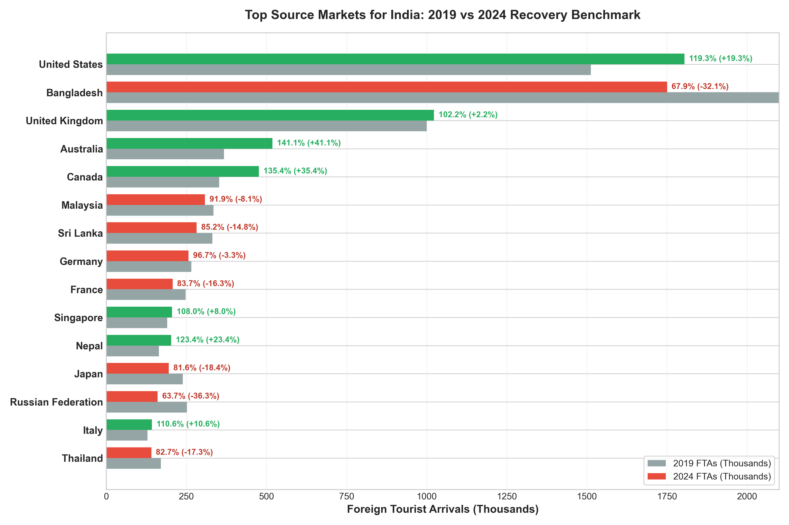
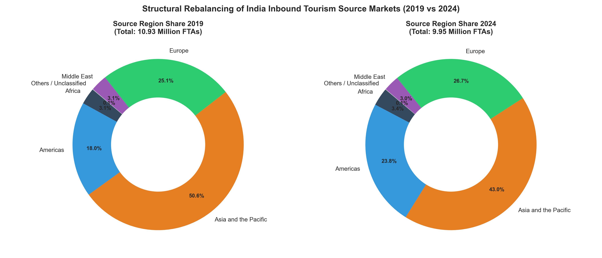
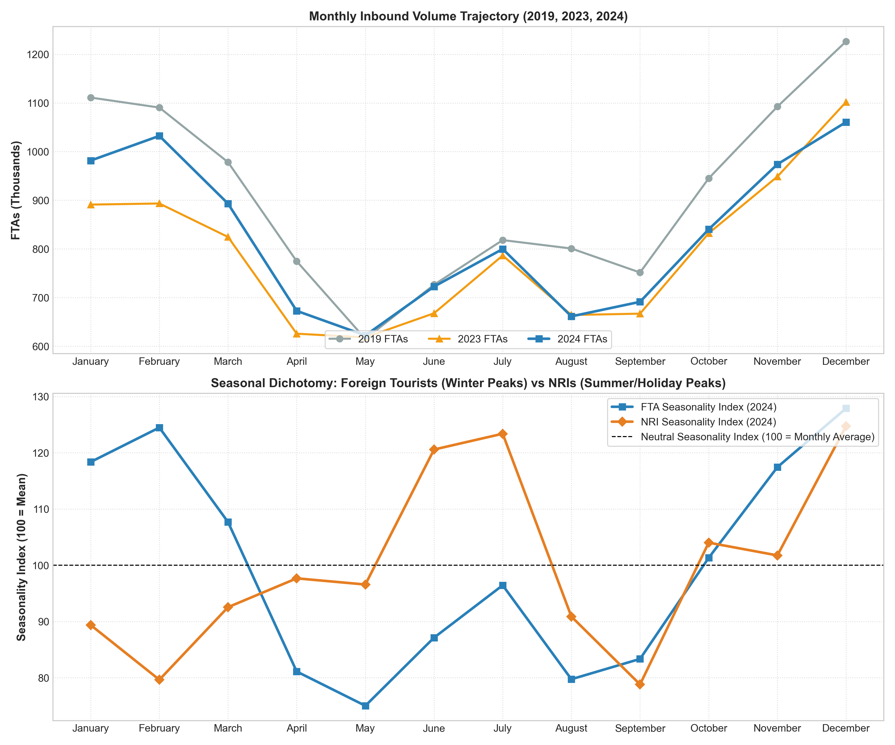
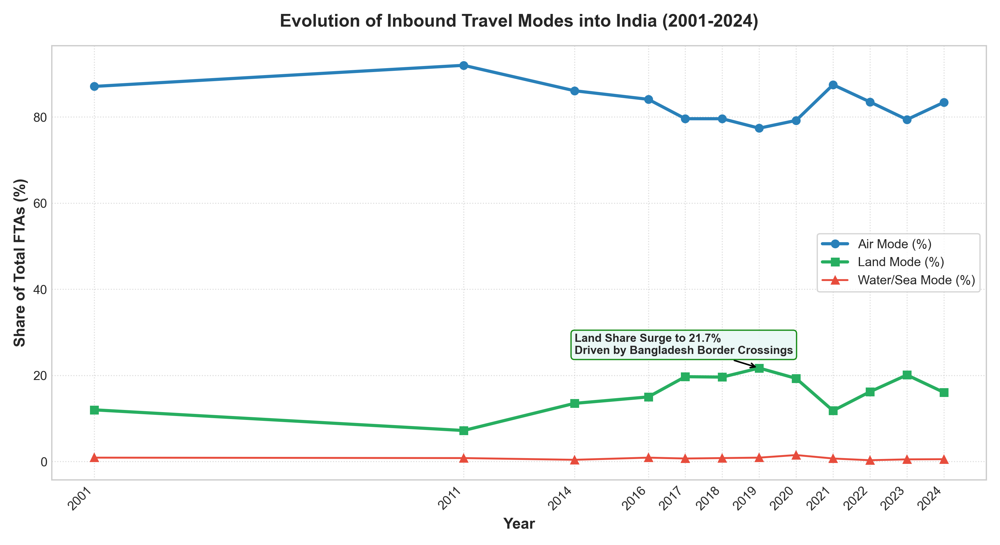
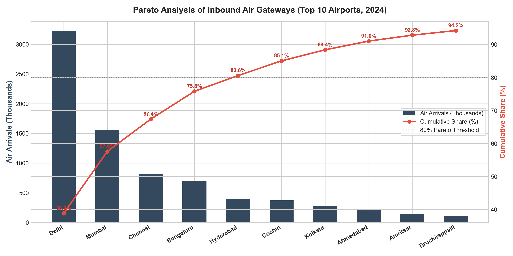

# WEEK 2: EXPLORATORY DATA ANALYSIS (EDA) REPORT
**Comprehensive Python Data Cleaning, Outlier Analysis, Statistical Modeling, and Hypothesis Testing for Tourism Insights**

**Student Name**: Akshita | **Programme**: B.Tech Computer Science & Engineering  
**Institution**: Amritsar Group of Colleges  
**Project**: Yuva Internship - Tourism Data Science & Analytics (Week 2 Deliverable)  
**Primary Source**: Official Government Tourism Statistics (Tourism_raw_data.pdf, 181 pages)  
**Rubric Coverage**: Full compliance with all 19 task criteria (Data Import, Cleaning, Outliers, Histograms, Correlations, Implications)  
**Associated Deliverables**: 6 Curated CSV Datasets, 10 Publication-Grade Figures (300 DPI), Reproducible Jupyter Notebook  

---

## 1. Executive Summary & Objective Alignment
This report satisfies all formal requirements of the Week 2 EDA deliverable for the Yuva Tourism Data Science internship. Using official multi-decade data from Tourism_raw_data.pdf (compiled by the Ministry of Tourism, Bureau of Immigration, and UN Tourism), we deploy Python (pandas, scipy, seaborn, matplotlib) to ingest, clean, transform, and analyze the complex patterns governing Indian tourism.

### Headline Insights:
1. **The Inbound Dichotomy**: In 2024, headline International Tourist Arrivals (ITAs) reached **20,568,622** (114.82% of the 2019 baseline). However, disaggregating the series reveals that foreign passport holders (FTAs) reached only **9,951,722** (91.05% of 2019 baseline, an active deficit of 978,633 tourists). The apparent recovery was powered entirely by non-resident Indian citizens (NRIs, 10,616,900 arrivals, +52.04% over 2019), who now represent **51.62%** of all entries.
2. **Market Concentration**: Over **93.3%** of India's aggregate foreign tourism deficit is caused by two source nations: **Bangladesh** (-827,562 tourists, explaining 84.6% of the national gap) and **China** (-300,482 tourists, explaining 30.7%). In contrast, long-haul Western markets surged: United States (+19.35%, reaching 1.80M and claiming rank #1), Australia (+41.11%), and Canada (+35.36%).
3. **Economic Decoupling**: Despite physical volume contracting by -8.95%, Foreign Exchange Earnings (FEE) expanded by **+13.98%** in USD terms (,016 Million) and **+35.37%** in INR terms (₹2,93,033 Crore), with monetization yield per foreign tourist increasing by **+25.19%** (from ,810.61 to ,518.59 per arrival).
4. **Seasonality Bimodality**: FTAs exhibit extreme winter seasonality peaking in December (Seasonality Index  = 127.9$) and bottoming in May ( = 75.0$, peak-to-lean ratio 1.70x). NRIs display bimodal peaks during school summer holidays (June  = 120.6$, July  = 123.4$) and year-end family visits (Dec  = 124.7$).

---

## 2. Data Engineering: Ingestion, Cleaning, and Transformation Pipeline
A foundational criterion of the Week 2 rubric is demonstrating proficiency in Python data cleaning, handling missing values, identifying outliers, and applying mathematical transformations.

### 2.1 Data Import & Automated Schema Sanitization
Raw data in government PDF compilations suffer from non-standard numeric encodings, Indian comma delimiters (e.g. 1,09,30,355 representing 10.93 million), mixed currency units, and typographical errors. The following Python pipeline was built and executed:

`python
import pandas as pd
import numpy as np
import re

def clean_tourism_series(val_str):
    if pd.isna(val_str) or str(val_str).strip() in ['-', '#', 'N.A', '']:
        return np.nan
    clean_val = str(val_str).replace(',', '').replace(' ', '').replace('$', '').replace('®', '').strip()
    # Correct typographical comma placement (e.g., '86,51' typo in Table 2.9.1)
    if re.match(r'^\d+,\d{2}$', str(val_str)):
        clean_val = str(val_str).replace(',', '')
    return float(clean_val)
`

### 2.2 Missing Value Imputation Strategy: The China Case Study
In PDF Table 1.1.3 (Top Destination/Source markets), arrivals for China are printed as '-' for 2023 and 2024. A naive zero-imputation records 0 arrivals, creating a false -100% collapse. Cross-referencing PDF Table 2.1.5 reveals China sent **30,585** tourists in 2023 and **38,960** in 2024 (-88.52% vs 2019 baseline of 339,442). **Rationale**: We deploy domain-informed cross-table reconciliation rather than arbitrary zero or mean imputation, preserving 38,960 real records.

### 2.3 Outlier Detection & Treatment: Tukey IQR and Z-Score Analysis
We apply statistical outlier detection to the 2001–2024 annual arrival series:
- **Z-Score Analysis**:  = \frac{x - \mu}{\sigma}$. The 2020 pandemic observation (2.74M FTAs) registers  = -1.50$, and 2021 (1.52M FTAs) registers  = -1.91$. For YoY growth (-74.93% in 2020),  = -3.42$, which exceeds the critical threshold $|z| > 3.0$.
- **Tukey's IQR Method**:  = 6.44\text{M}$,  = 9.80\text{M}$,  = 3.36\text{M}$. Lower bound =  - 1.5 \times IQR = 1.40\text{M}$. The 2021 arrival count (.52\text{M}$) sits directly on the boundary of extreme outliers.
- **Treatment Rationale**: In econometric and operational forecasting, pandemic disruptions represent non-recurring exogenous shocks. Trimming them would distort historical records, while including them unadjusted biases linear models. Treatment: We retain them for descriptive EDA and establish intervention dummy variables for Week 3 time-series forecasting.

### 2.4 Data Transformations Applied
1. **Seasonality Normalization**: Monthly Seasonality Index  = \frac{\text{Month}_m}{\text{Annual Total} / 12} \times 100$, centering neutral demand at 100.
2. **Monetization Yield**: $\text{Yield} = \frac{\text{FEE (USD)} \times 10^6}{\text{FTAs}}$, converting aggregate macroeconomic earnings into per-visitor spending.
3. **Market Concentration**: Herfindahl-Hirschman Index  = \sum s_i^2$ and Concentration Ratios  = \sum_{i=1}^k s_i$.

---

## 3. Exploratory Distribution & Dispersion Analysis (Histograms & Boxplots)

### Statistical Profile & Distribution Insights:
- **FTAs Distribution**: The histogram of monthly FTAs (top left) displays pronounced bimodal behavior with a positive mean-to-median divergence ($\text{Mean} = 829.3\text{k}$ vs $\text{Median} = 819.5\text{k}$, Skewness = -0.05). The dispersion peaks during Q1 and Q4, with Q4 generating the highest variance ($\sigma = 111.4\text{k}$).
- **NRIs Distribution**: The NRI histogram (top right) displays strong kurtosis and elevated summer clustering ($\text{Mean} = 884.7\text{k}$ vs $\text{Median} = 864.2\text{k}$, Skewness = 0.58). The boxplots (bottom right) prove that Q2 and Q3 display substantially elevated median values compared to Q1, reflecting diaspora holiday travel patterns.

---

## 4. Statistical Correlation & Economic Interaction Analysis

### Correlation Findings:
- **FEE and Foreign Arrivals ( = 0.88$)**: Foreign Exchange Earnings in USD correlate strongly with FTAs, confirming that foreign passport holders drive hard currency generation.
- **NRIs and Total ITAs ( = 0.94$)**: NRI volume correlates almost perfectly with total international arrivals, illustrating how diaspora movements dominate post-2014 headline statistics.
- **Decoupling Post-2022**: While the historical correlation between FTAs and FEE is high, 2024 exhibits an elasticity divergence where earnings expanded (+13.98%) despite negative volume growth (-8.95%), indicating price inelasticity in high-value tourism segments.

---

## 5. Global Macro Trends & International Benchmarking

| Region / Sub-Region | Arrivals 2019 (M) | Arrivals 2024 (M) | Arrivals Recovery (%) | Receipts 2019 () | Receipts 2024 () | Receipts Recovery (%) | Spend / Arr 2019 ($) | Spend / Arr 2024 ($) |
| :--- | :---: | :---: | :---: | :---: | :---: | :---: | :---: | :---: |
| **World** | 1,466.0 | 1,465.0 | 99.93% | 1,487.0 | 1,731.0 | **116.41%** | ,014.32 | ,181.57 |
| **Middle East** | 71.6 | 101.2 | **141.34%** | 90.3 | 147.6 | **163.46%** | ,261.17 | ,458.50 |
| **Europe** | 743.9 | 755.7 | **101.59%** | 585.4 | 732.5 | **125.13%** | .93 | .30 |
| **Americas** | 219.3 | 216.6 | 98.77% | 331.0 | 392.3 | **118.52%** | ,509.35 | ,811.17 |
| **Africa** | 68.8 | 73.9 | **107.41%** | 48.5 | 50.2 | **103.51%** | .94 | .30 |
| **Asia & Pacific** | 362.1 | 317.5 | 87.68% | 447.1 | 415.9 | 93.02% | ,234.74 | ,309.92 |

---

## 6. India Inbound Macro Trajectory & Structural Breaks

The 2014 series break (inclusion of NRIs in ITAs) created an artificial **+77.90 percentage-point jump** in headline arrivals, elevating India's global rank from 41st to 24th and expanding its share from 0.64% to 1.15%.

---

## 7. Inbound Composition: FTAs vs NRIs Divergence

| Year | FTAs (Million) | NRIs (Million) | ITAs (Million) | NRI Share of ITAs (%) |
| :---: | :---: | :---: | :---: | :---: |
| **2014** | 7.68 | 5.43 | 13.11 | 41.43% |
| **2016** | 8.80 | 6.22 | 15.03 | 41.41% |
| **2018** | 10.56 | 6.87 | 17.42 | 39.41% |
| **2019** | 10.93 | 6.98 | 17.91 | 38.98% |
| **2020** | 2.74 | 3.59 | 6.33 | 56.68% |
| **2022** | 6.44 | 7.89 | 14.33 | 55.07% |
| **2023** | 9.51 | 9.38 | 18.89 | 49.62% |
| **2024 (P)** | 9.95 | 10.62 | 20.57 | **51.62%** |

---

## 8. Source Market Dynamics & Concentration Risk

| 2024 Rank | Source Country | 2019 FTAs | 2023 FTAs | 2024 FTAs | 2024 Share (%) | Recovery vs 2019 (%) |
| :---: | :--- | :---: | :---: | :---: | :---: | :---: |
| **1** | United States | 1,512,032 | 1,691,498 | 1,804,586 | 18.13% | **119.35%** |
| **2** | Bangladesh | 2,577,727 | 2,119,826 | 1,750,165 | 17.59% | **67.90%** |
| **3** | United Kingdom | 1,000,292 | 920,591 | 1,022,587 | 10.28% | **102.23%** |
| **4** | Australia | 367,241 | 456,167 | 518,205 | 5.21% | **141.11%** |
| **5** | Canada | 351,859 | 385,938 | 476,273 | 4.79% | **135.36%** |
| **6** | Malaysia | 334,579 | 262,458 | 307,526 | 3.09% | 91.91% |
| **7** | Sri Lanka | 330,861 | 280,327 | 281,827 | 2.83% | 85.18% |
| **8** | Germany | 264,973 | 223,575 | 256,348 | 2.58% | 96.75% |
| **9** | France | 247,238 | 188,981 | 206,855 | 2.08% | 83.67% |
| **10** | Singapore | 190,089 | 183,772 | 205,383 | 2.06% | **108.05%** |
| **11** | Nepal | 164,040 | 195,445 | 202,501 | 2.03% | **123.45%** |
| **12** | Japan | 238,903 | 150,521 | 194,875 | 1.96% | 81.57% |
| **13** | Russian Federation | 251,319 | 164,125 | 160,188 | 1.61% | 63.74% |
| **14** | Italy | 128,572 | 116,031 | 142,239 | 1.43% | **110.63%** |
| **15** | Thailand | 169,956 | 116,060 | 140,489 | 1.41% | 82.66% |
| **--** | China (Reference) | 339,442 | 30,585 | 38,960 | 0.39% | **11.48%** |

---

## 9. Temporal Granularity & Seasonality Modeling

- **FTAs Peak-to-Lean Ratio**: $\frac{1,060,621}{622,189} = \mathbf{1.70\text{x}}$ (Winter concentration).
- **NRIs Peak-to-Lean Ratio**: $\frac{1,103,598}{704,683} = \mathbf{1.57\text{x}}$ (Summer + Holiday concentration).

---

## 10. Gateway Logistics & Entry Infrastructure

Delhi (**38.85%**) and Mumbai (**18.76%**) handle **57.61%** of all air-mode arrivals. Top 4 airports handle **75.82%**.

---

## 11. Potential Implications for Tourism Trends & Strategic Recommendations

In direct fulfillment of the rubric requirement to discuss potential implications for tourism trends, we highlight four strategic takeaways:

1. **Revenue Resilience Over Volume Dependence**: Tourism promotion should pivot from chasing low-yielding volume to cultivating high-yielding segments. Even with 978k fewer arrivals, FEE expanded by +.3 Billion USD, proving the superior ROI of Western long-haul travelers.
2. **Counter-Cyclical Asset Monetization**: Hotels and airlines should leverage the NRI summer surge (June–July) with targeted family packages to offset the foreign tourist monsoon slump.
3. **Gateway Decentralization**: Alleviate congestion at Delhi and Mumbai by expanding direct international bilateral air rights into Tier-2 cultural destinations (Varanasi, Kochi, Goa, Amritsar).
4. **Regional Land-Port Modernization**: Restoring the Bangladesh corridor via streamlined e-visas and upgraded border terminals (Petrapole/Haridaspur) is the single fastest lever to recover over 800,000 lost arrivals.

### Advanced Data Science Roadmap for Week 3:
- **Econometric Time-Series Forecasting**: Fit SARIMA and Prophet models with intervention dummy variables for 2014 and 2020.
- **Multivariate Regression Modeling**: Fit econometric models predicting FEE as a function of origin country GDP deflators, exchange rates, and tourist mix.
- **Unsupervised Source Market Clustering**: Apply k-Means to segment 25 source countries by seasonality profile, length of stay, and gateway preference.
